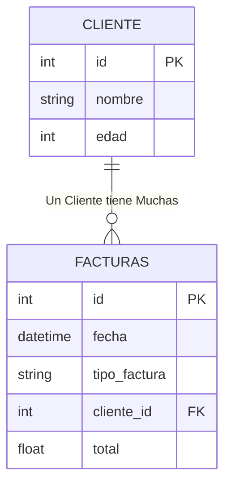
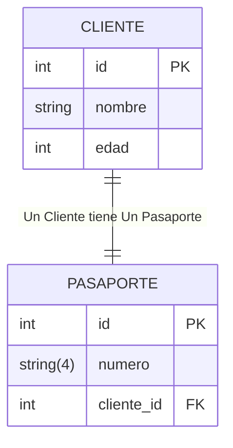

# Ejercicio A

1) Cree la base de datos `facturacion.db` Codifique la tabla Cliente y la Tabla Factura , con una relacion __One to Many__

```python
# Imports utiles
from sqlalchemy import create_engine, String, Integer, Float, Boolean, DateTime , ForeignKey
from sqlalchemy.orm import DeclarativeBase, Mapped, mapped_column , Session ,relationship 
from datetime import datetime
from sqlalchemy import  create_engine , select 
```
---


2) Cree almenos 2 Objeto clientes y cree dos objetos facturas para ambos. Relacionelo

```python
# 2) CREACION DE CLIENTE Y FACTURA

cl1 = Cliente(nombre="Francisco",edad=22)
cl2 = Cliente(nombre="Nicolas",edad=25)

fc1 = Factura(total=2500.24)
fc2 = Factura(total=5500.84)
fc3 = Factura(total=30.14)
fc4 = Factura(total=15500.84)


cl1.facturas = [fc1,fc2]
cl2.facturas = [fc3,fc4]
```
3) una vez subidos , obtenga los clientes , e imprima el monto total de todas las facturas que tiene

# Ejercicio B
Crear una relación One-to-One entre las tablas Cliente y Pasaporte, en la que cada cliente tenga un único pasaporte, y cada pasaporte pertenezca a un solo cliente


---
