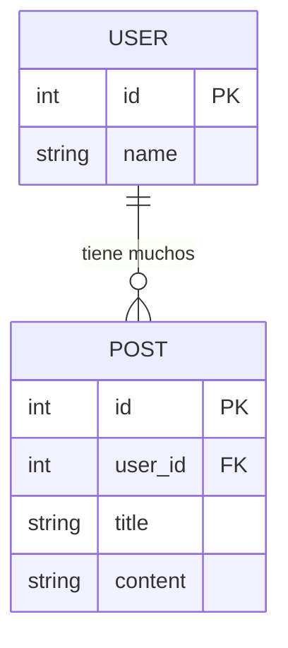
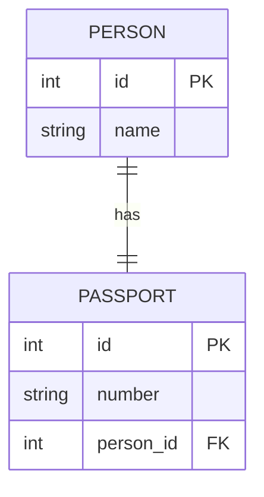
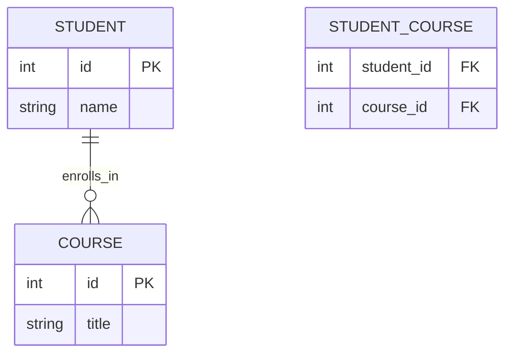

## Relaciones

permite definir relaciones entre clases Python que reflejan las relaciones entre tablas en una base de datos.
Estas relaciones se configuran usando la función relationship() combinada con claves foráneas (ForeignKey). Si ya has visto bases de Datos sabras que hay distintos tipos de relaciones para distintios tipos de situaciones.

## Índice
- [Readme](/README.MD)
- [Relaciones](#relaciones)
- [Cuadro De Tipo de Relaciones](#cuadro-de-tipo-de-relaciones)
- [Como se hacen](#como-se-hacen)
- [One To Many](#one-to-many)
  - [Diagrama ER One To Many](#diagrama-er-one-to-many)
- [One To One](#one-to-one)
  - [Diagrama ER One To One](#diagrama-er-one-to-one) <!-- puedes corregir el ancla si quieres que sea One To One -->
- [Many To Many](#many-to-many)
  - [Tabla Intermediaria](#tabla-intermediaria)
  - [Diagrama ER Many To Many](#diagrama-er-many-to-many)

## Cuadro De Tipo de Relaciones

| Tipo de Relación | Descripción | Ejemplo de Clases | Clave Foránea / Tabla Intermedia | Características |
|------------------|-------------|-------------------|----------------------------------|-----------------|
| **One-to-Many** (Uno a Muchos) | Un registro del padre tiene muchos hijos. | `User → Post` | La FK está en `Post.user_id` | `relationship()` devuelve una **lista**. Se usa `back_populates` para sincronizar ambos lados. |
| **Many-to-One** (Muchos a Uno) | Muchos hijos pertenecen a un mismo padre. | `Post → User` | La FK está en `Post.user_id` | Inverso del One-to-Many. Cada hijo tiene una única referencia al padre. |
| **One-to-One** (Uno a Uno) | Un registro está relacionado con exactamente uno en la otra tabla. | `User ↔ Profile` | FK única (`UniqueConstraint`) en `Profile.user_id` | Se usa `uselist=False` o tipos no coleccionables (`Mapped["Profile"]`). |
| **Many-to-Many** (Muchos a Muchos) | Varios registros de una tabla se asocian con varios de otra. | `Student ↔ Course` | Tabla intermedia (`association_table`) | Usa `relationship(secondary=...)` y colecciones (`List` o `Set`). |
| **Association Object** | Variante de Many-to-Many con datos adicionales en la tabla intermedia. | `Student ↔ Enrollment ↔ Course` | Clase intermedia (`Enrollment`) | La tabla intermedia tiene columnas extra y se mapea como una clase ORM. |

## Como se hacen

-se usa `relationship(back_populates="nombre_de_tabla")` para relacionarse.
-se debe crear una llave Foranea `mapped_column(ForeignKey("user.id"))` para indicar con que se relaciona


## One To Many
La relacion one to many (uno a muchos ) un padre tiene muchos hijos , pero un hijo tiene solo un padre.

Basicamente (A) tiene muchos (B) , pero (B) solo tiene un (A)

EJ:un usuario tiene muchos post , pero un post tiene un solo usuario

```python
from typing import List
from sqlalchemy import ForeignKey
from sqlalchemy.orm import Mapped, mapped_column, relationship, DeclarativeBase

class Base(DeclarativeBase):
    pass

class User(Base):
    __tablename__ = "user"
    id: Mapped[int] = mapped_column(primary_key=True)
    posts: Mapped[List["Post"]] = relationship(back_populates="user")

class Post(Base):
    __tablename__ = "post"
    id: Mapped[int] = mapped_column(primary_key=True)
    user_id: Mapped[int] = mapped_column(ForeignKey("user.id"))
    user: Mapped["User"] = relationship(back_populates="posts")

# User.posts → lista de objetos Post.
# Post.user → referencia única al User.
```
#### Claves:

- La FK (ForeignKey) se define en la tabla hija (Post).

- back_populates enlaza las relaciones en ambas direcciones.

- Se puede usar cascade="all, delete-orphan" si quieres que al eliminar el padre se eliminen sus  hijos.(Osea si quieres que cuando se elimne un usuario se eliminen sus post)
---
### Diagrama ER One To Many



## One To One

Indica que A tiene un B y que B solo tiene un A , basicamente el Padre conoce a su unico Hijo y el Hijo conoce a su unico Padre.

la forma de hacerlo es exactamente la misma que en la anterior , solo que la diferencia es que en vez de tener un array de objetos , tenemos simplemente un Atributo

```python
from sqlalchemy import ForeignKey, Integer, String
from sqlalchemy.orm import DeclarativeBase, Mapped, mapped_column, relationship

class Base(DeclarativeBase):
    pass

class Person(Base):
    __tablename__ = "person"

    id: Mapped[int] = mapped_column(primary_key=True)
    name: Mapped[str] = mapped_column(String(50))
    
    # One-to-One relationship
    passport: Mapped["Passport"] = relationship(
        back_populates="person",
        uselist=False  # asegura que sea One-to-One
    )

class Passport(Base):
    __tablename__ = "passport"

    id: Mapped[int] = mapped_column(primary_key=True)
    number: Mapped[str] = mapped_column(String(20))
    person_id: Mapped[int] = mapped_column(ForeignKey("person.id"), unique=True)
    
    # Vincula de vuelta a la persona
    person: Mapped["Person"] = relationship(back_populates="passport")

```
---
#### Claves

+ __uselist__=False en la relación de Person a Passport indica uno a uno.

+ __person_id__ en Passport es `unique=True`, asegurando que un Passport solo puede pertenecer a una persona.

+ __back_populates__ hace que la relación sea bidireccional

---
### Diagrama ER One To One



## Many To Many

La relacion mucho a muchos como su nombre lo indica significa que muchos registros de la tabla (A) tienen relacion con los de la tabla (B) y viceversa. un ejemplo practico , muchas personas compran un producto , y muchas productos pueden ser comprados por varias personas .

```python
from sqlalchemy import Table, ForeignKey
from sqlalchemy.orm import DeclarativeBase, Mapped, mapped_column, relationship

class Base(DeclarativeBase):
    pass

# Tabla de asociación para la relación muchos a muchos
student_course = Table(
    "student_course",
    Base.metadata,
    mapped_column("student_id", ForeignKey("student.id"), primary_key=True),
    mapped_column("course_id", ForeignKey("course.id"), primary_key=True),
)

class Student(Base):
    __tablename__ = "student"
    id: Mapped[int] = mapped_column(primary_key=True)
    name: Mapped[str]
    courses: Mapped[list["Course"]] = relationship(
        secondary=student_course, back_populates="students"
    )

class Course(Base):
    __tablename__ = "course"
    id: Mapped[int] = mapped_column(primary_key=True)
    title: Mapped[str]
    students: Mapped[list["Student"]] = relationship(
        secondary=student_course, back_populates="courses"
    )
```

### Tabla Intermediaria
como vemos en many-to-many necesitamos una tabla que actue como intermediaria , ya que no puedes tener dos columnas en dos tablas apuntando a muchas filas simultáneamente sin un intermediario.

- La tabla de asociación (association table) almacena los pares (student_id, course_id).

- Sin ella, la base de datos no podría saber qué estudiantes están en qué cursos, porque no existe un lugar para guardar múltiples referencias.

- Incluso si no quieres información extra (como fecha de inscripción), la tabla intermedia es obligatoria a nivel de base de datos.

```bash
Student         Student_Course          Course
+----+         +-----------+          +----+
| id |<------->| student_id|<-------> | id |
+----+         | course_id |          +----+
               +-----------+

```

### Diagrama ER Many To Many


[Volver Arriba ↑](#índice)