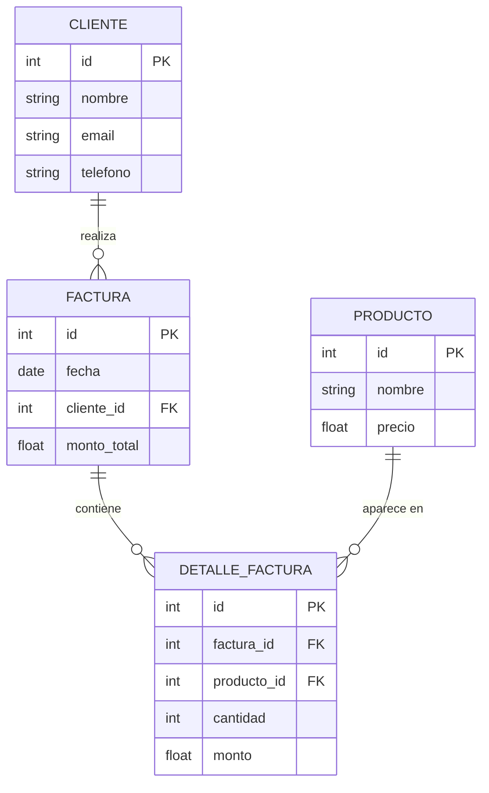

# Inegrador I

1) Codifique las siguiente Tabla


---
## Tabla

2) Se debe respetar esta tabla

| Relación                          | Tipo       | Descripción                                          |
| --------------------------------- | ---------- | ---------------------------------------------------- |
| Cliente → Factura                 | 1 a muchos | Un cliente puede tener muchas facturas               |
| Factura → DetalleFactura          | 1 a muchos | Una factura tiene varios ítems                       |
| Producto → DetalleFactura         | 1 a muchos | Un producto puede aparecer en varias facturas        |
| DetalleFactura → Factura/Producto | muchos a 1 | Cada detalle pertenece a una factura y a un producto |

## Creacion de Objetos:

3) Cree almenos 3 Clientes
4) Crear Facturas para clientes , Almenos 1 cliente debe tener mas de 2 facturas
5) Crear 2 DetallesFacturas para Cada Factura ,Almenos 1 Factura con 4 detalles
6) Crear 8 Productos


## Metodos 

7) Cree un metodo para que el monto_total de factura se calcule 

💡 Pista :
Si hacés un método tipo agregar_detalle(), pensá que ese puede ser el “punto central” donde se:
Añade el detalle a la lista de la factura.
Se recalcula el total (sumando subtotales).

## Consultas:

9) Muestra por consola a los clientes  y la suma total del monto total de las facturas.

```bash
Cliente Akira Monto Total de sus Facturas 10503.94
Cliente Francisco Monto Total de sus Facturas 40289.5
Cliente Lorenzo Monto Total de sus Facturas 18001.4
```
---

10) Muestre por consola todos los detalles de la Factura incluyendo el producto , y el precio del producto.

```bash
-(Akira):
 |-Producto-[Cebolla Picada]
   |-Cantidad →6
   |-Monto Total →3001.44
 |-Producto-[Bacon]
   |-Cantidad →5
   |-Monto Total →7502.5

```