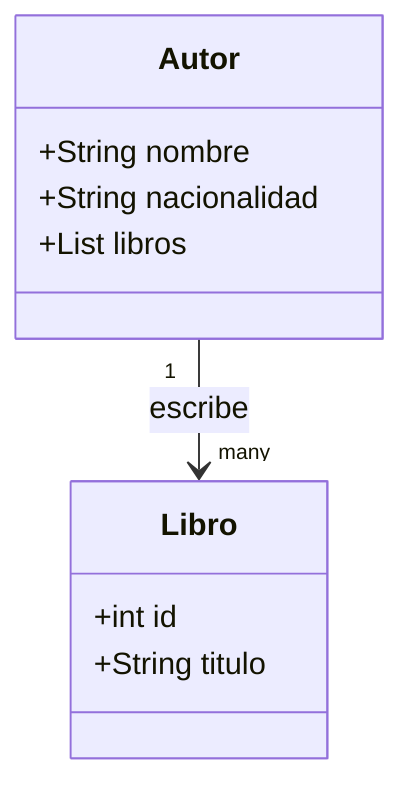

# Ejercicio II

## Ejercicio (A)

1) Codifique la siguientes clases:



2) Instancie 1 objeto Autor y un objeto Libro

3) Mediante Metodo POST cree un Autor 

4) Mediante Metodo POST cree un Libro

## Ejercicio (B) 

Dado el siguiente codigo

from fastapi import FastAPI
from pydantic import BaseModel
import random

```python
# Modelo Persona
class Persona(BaseModel):
    id: int
    nombre: str
    edad: int

# Creamos la aplicación FastAPI

# Lista de posibles nombres
nombres_posibles = [
    "Francisco", "Ana", "Carlos", "María", "Luis", "Pingardon", 
    "Nicolas", "Gerardo", "Juan", "Elena", "David", "Selucio"
]

# Generar 10 personas aleatorias
lista_de_personas = [
    Persona(id=i, nombre=random.choice(nombres_posibles), edad=random.randint(18, 80))
    for i in range(1, 11)
]

app = FastAPI()

@app.get("/")
async def root():
    return {"msg":"root"}

@app.get("/Personas")
async def get_persona():
    return lista_de_personas

@app.get("/Personas/{id}")
async def get_by_id(id:int):
    return persona_by_id(id)

def persona_by_id(id:int):
    result = next((p for p in lista_de_personas if p.id == id),None)
    return result
```


1) cree un metodo PUT donde se pueda editar mediante id pasado por parametro

