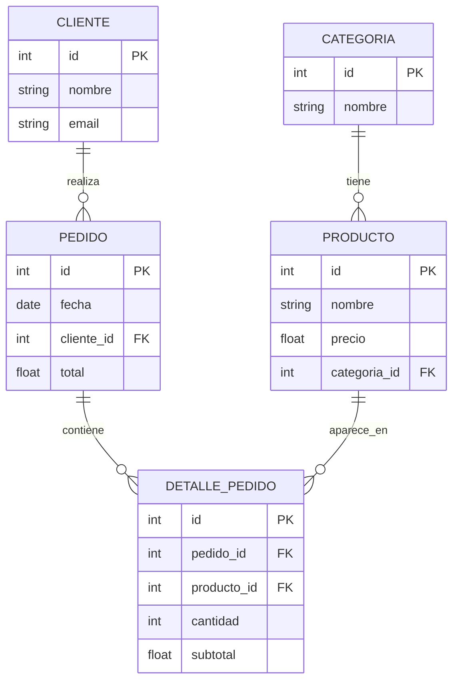

# Ejercicio Integrador I FastAPI

El siguiente ejercicio tiene como objetivo reforzar lo aprendido en las secciones anteriores de fastpi y sqlalchemy

## 1) Crear un proyecto FastAPI con SQLAlchemy siguiendo la siguiente estructura

Debe respetarse:

```plaintext
app/
 ├── main.py
 ├── models.py
 ├── schemas.py
 ├── crud.py
 ├── database.py
 
```

## 2) Crear el siguiente modelo Relacional

Usar este diagrama:



+ Crea los modelos teniendo en cuenta que si un cliente se elimina todos sus pedidos y detalles pedido se eliminaran tambien , no deben eliminarse los productos.

#### Cliente
```py
pedidos: Mapped[list["Pedido"]] = Relationship(
    back_populates="cliente",
    cascade="all, delete-orphan"
)
```
#### Pedido
```py
cliente_id: Mapped[int] = mapped_column(
    ForeignKey("cliente.id", ondelete="CASCADE")
)

```

## 3) Creacion de Schemas

ModelBase → ModelCreate → Model (con orm_mode=True)

## 4) Archivo CRUD 

CRUD completo para:

+ ####  Categoría
    + get
    + get categoria por id
+ #### Producto
    + get
    + get_producto por id
+ #### Cliente
    + get
    + get_cliente por id
    + delete_cliente por id
    + get_total pedido cliente por id
+ #### Pedido
    + get
    + get_categoria por id
+ #### DetallePedido
    + get
    + get_categoria por id

## 5) Crear endpoints en main.py 

#### CATEGORIAS

+ POST /categorias

+ GET /categorias

#### PRODUCTOS

+ POST /productos

+ GET /productos

+ GET /productos/{id}

#### CLIENTES

+ POST /clientes

+ GET /clientes

+ GET /clientes/{id}

+ GET /clientes/{id}/total 
    + Cree un metodo que devuelta el total del pedido de un cliente mediante un id
    + Debes crear los metodos dentro de las clases o crud.
+ DELET /clientes/{id}

#### PEDIDOS

+ POST /pedidos (solo fecha + cliente)

+ POST /pedidos/{id_pedido}/detalles (agrega detalles)

+ GET /pedidos/{id} (incluye detalles)