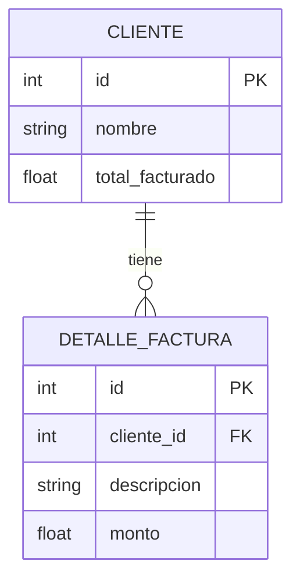

## 1) Estructura del proyecto (igual a la del ejercicio anterior)

```textplain
app/
 ├── main.py
 ├── models.py
 ├── schemas.py
 ├── crud.py
 ├── database.py
```

## 2) Modelo relacional

Diagrama:




#### Si se elimina un cliente, también se eliminan sus facturas.

#### Cada vez que:

+ Se agregue una factura nueva

+ Se modifique una factura existente

+ O se elimine una factura
→ Debe recalcularse automáticamente el total del cliente.

## 3) Endpoints en main.py
#### CLIENTES

+ POST /clientes

+ GET /clientes

+ GET /clientes/{id}

#### FACTURAS

+ POST /facturas

+ PUT /facturas/{id} → modificar monto

+ DELETE /facturas/{id}

